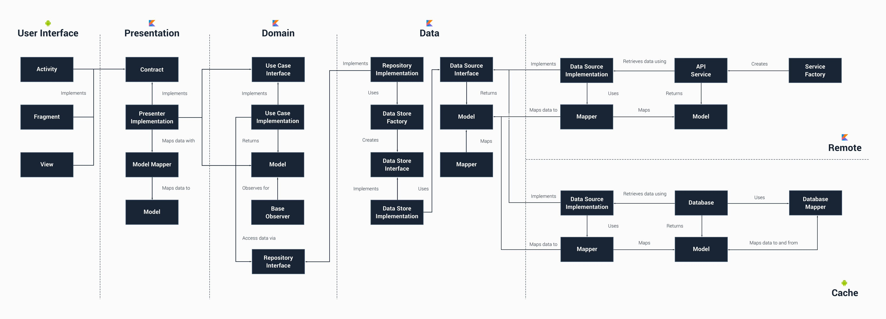

# Fitness tracking App

### Status: Under Development

## Screenshots

| Screenshots      | In Progress             |
|----------------	|------------------------------	|

## 🏗️️ Built with ❤️ using Jetpack Compose 😁

| What            | How                        |
|----------------	|------------------------------	|
| 🎭 User Interface (Android)   | [Jetpack Compose](https://developer.android.com/jetpack/compose)                |
| 🏗 Architecture    | [Clean](https://blog.cleancoder.com/uncle-bob/2012/08/13/the-clean-architecture.html)                            |
| 💉 DI (Android)                | [Hilt](https://developer.android.com/training/dependency-injection/hilt-android)                        |
| 🌊 Async            | [Coroutines](https://kotlinlang.org/docs/coroutines-overview.html) + [Flow](https://kotlin.github.io/kotlinx.coroutines/kotlinx-coroutines-core/kotlinx.coroutines.flow/-flow/)                |
| 🌐 Networking        | [Retrofit](https://square.github.io/retrofit/)                        |
| 📄 Parsing            | [KotlinX](https://kotlinlang.org/docs/serialization.html)                            |

## Languages, libraries and tools used

- [Kotlin](https://kotlinlang.org/)
- AndroidX libraries
- [Android Architecture Components](https://developer.android.com/topic/libraries/architecture)
- [Dagger 2](https://github.com/google/dagger)
- [Retrofit](http://square.github.io/retrofit/)
- [Kotlin Coroutines](https://developer.android.com/kotlin/coroutines)

## Architecture

Runner follows the principles of Clean Architecture with Android Architecture Components.

### Architecture's layers & boundaries:

